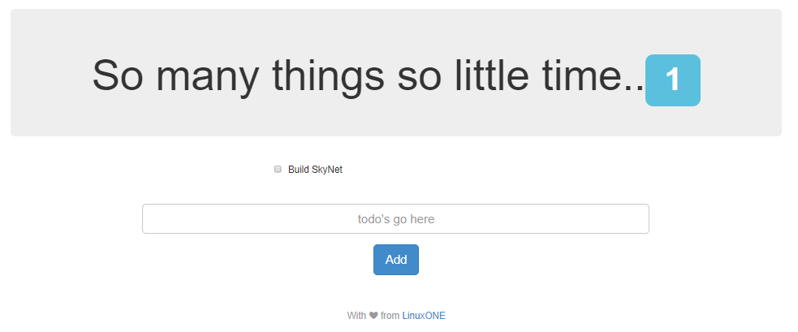

# Build and run open source cloud native workloads on LinuxONE using Docker

Open source software has expanded from a low-cost alternative to a platform for enterprise databases, clouds and next-generation apps. These workloads need higher levels of scalability, security and availability from the underlying hardware infrastructure.

LinuxONE was built for open source so you can harness the agility of the open revolution on the industry’s most secure, scalable and high-performing Linux server. In this journey we will show how to run open source Cloud-Native workloads on LinuxONE using Docker. We will show how existing LinuxONE docker images from docker hub can be used as is for deploying open source workloads. 

If the desired images don't exist, we also show how you can create your own dokcer images for the workload. The z architecture has a different instruction set from the typical machines used in distributed environments. If the Dockerfile has build steps that build native code, the right platform of the compile flags must be used to make it work on LinuxONE, in addition to accounting for specific packages which can be used with LinuxONE. The second part of this Journey goes into those details.


 
## Scenarios

1. [Scenario One: Use Docker images from Docker hub to run your workloads on LinuxONE](#scenario-one-use-docker-images-from-docker-hub-to-run-your-workloads-on-linuxone)     
    1.1 [WebSphere Liberty](#1-install-and-run-websphere-liberty)     
    1.2 [WordPress](#2-install-and-run-wordpress)          
2. [Scenario Two: Create your own Docker images for LinuxONE](#scenario-two-create-your-own-docker-images-for-linuxone)     
    2.1 [MEAN Stack](#1-install-and-run-mean-application)

## Included Components

- [LinuxONE](https://www.ibm.com/linuxone/open-source)
- [Docker](https://www.docker.com)
- [WordPress](https://wordpress.org/about/)
- [MEAN](https://mean.io/)
- [WebSphere Liberty](https://hub.docker.com/r/s390x/websphere-liberty/)
- [MEAN Stack](http://mean.io/)

## Prerequisites

Register at [LinuxONE Community Cloud](https://developer.ibm.com/linuxone/) for a trial account. We will be using a Ret Hat base image for this journey, so be sure to chose the 'Request your trial' button on the left side of this page.

## Scenario One: Use Docker images from Docker hub to run your workloads on LinuxONE

[Docker Hub](https://hub.docker.com) makes it rather simple to get started with containers, as there are quite a few images ready to for your to use.  You can browse the list of images that are compatible with LinuxONE by doing a search on the ['s390x'](https://hub.docker.com/search/?isAutomated=0&isOfficial=0&page=1&pullCount=0&q=s390x&starCount=0) tag.

These instructions assume a base RHEL 7.2 image.

We need to be running as root:
```shell
$ sudo su -
```

### Install docker
First, we will need to download the correct Docker package archive from [this page](https://www.ibm.com/developerworks/linux/linux390/docker.html).  For version 1.11.2 on RHEL 7.2:
```shell
# wget ftp://ftp.unicamp.br/pub/linuxpatch/s390x/redhat/rhel7.2/docker-1.11.2-rhel7.2-20160623.tar.gz
```

Then, unpack the archive and copy the docker binarys:
```shell
# tar -xzvf docker-1.11.2-rhel7.2-20160623.tar.gz
# cp docker-1.11.2-rhel7.2-20160623/docker* /usr/local/bin/
```

And then start the docker daemon:
```shell
# docker daemon -g /local/docker/lib &
```
You should see something similar to this:
```shell
[root@devjourney07 ~]# docker daemon -g /local/docker/lib &
[1] 2332
[root@devjourney07 ~]# INFO[0000] New containerd process, pid: 2338

WARN[0000] containerd: low RLIMIT_NOFILE changing to max  current=1024 max=4096
WARN[0001] devmapper: Usage of loopback devices is strongly discouraged for production use. Please use `--storage-opt dm.thinpooldev` or use `man docker` to refer to dm.thinpooldev section.
INFO[0001] devmapper: Creating filesystem xfs on device docker-94:2-263097-base
INFO[0001] devmapper: Successfully created filesystem xfs on device docker-94:2-263097-base
INFO[0001] Graph migration to content-addressability took 0.00 seconds
INFO[0001] Firewalld running: false
INFO[0001] Default bridge (docker0) is assigned with an IP address 172.17.0.0/16. Daemon option --bip can be used to set a preferred IP address
INFO[0001] Loading containers: start.

INFO[0001] Loading containers: done.
INFO[0001] Daemon has completed initialization
INFO[0001] Docker daemon                                 commit=b9f10c9-unsupported graphdriver=devicemapper version=1.11.2
INFO[0001] API listen on /var/run/docker.sock
```

### Install docker-compose

Install dependencies

```shell
# yum install -y python-setuptools
```

Install pip with easy_install

```shell
# easy_install pip
```

Upgrade backports.ssl_match_hostname

```shell
# pip install backports.ssl_match_hostname --upgrade
```

Finally, install docker-compose itself
```shell
# pip install docker-compose
```
### 1. Install and run WebSphere Liberty

In this step, we will once again be using existing images from Docker Hub - this time to set up a WebSphere Application Server.  We will be implementing it for Java EE 7 Full Platform compliance.

#### 1. Docker Run

Now run the container (note: we will need to be logged in as root)

```shell
# docker run -d -p 80:9080 -p 443:9443 s390x/websphere-liberty:webProfile7
```

#### 2. Browse

Once the server is started, you can browse to
`http://[LinuxOne Host IP]`.


### 2. Install and run WordPress

Let's start off with everyone's favorite demo: an installation of WordPress. These instructions assume a base RHEL 7.2 image. Please follow the instructions [here](https://github.com/IBM/Scalable-WordPress-deployment-on-Kubernetes/blob/master/docs/deploy-with-docker-on-linuxone.md#steps) to Install and run WordPress on LinuxOne

## Scenario Two: Create your own Docker images for LinuxONE

In our previous scenario, we used a couple of container images that had already been created and were waiting for our use in the Docker Hub Community.  But what if you are looking to run a workload that is not currently available there?  In this scenario, we will walk through the steps to create your own Docker images.

This time we will go through the process of migrating an existing docker-compose.yaml from another architecture to the LinuxONE architecture. Note, that steps 1 to 5 are based on a F1 Stats app as an introduction to porting containers and step 6 is a simplification of the MEAN stack to use Angular 1 and a TODO application. Angular 1 makes extension and customization much easier. The code in [files/mean-docker](files/mean-docker) mirrors step 6 and while entirely possible to skip steps 1-5 and just start with step 6 to build the MEAN stack on LinuxONE, we highly recommend steps 1 to 5 are followed as a learning exercise.

### 1. Obtain the MEAN stack Docker components from GitHub

The MEAN stack is a combination of several packages starting with MongoDB - which is the most popular OSS NoSQL DB. The M*EAN* components stand for Express.js, Angular.js, Node.js. Node.js is a JavaScript runtime, Express.js is a server framework and Angular.js is an all-purpose MVC/MVVN framework. We will use this [blog](https://scotch.io/tutorials/create-a-mean-app-with-angular-2-and-docker-compose) and this [source code](https://github.com/gangachris/mean-docker/tree/master/express-server) as a starting point. This blog is also useful if you're new to Angular.js/Express.js.

```shell
version: '2' # specify docker-compose version

# Define the services/containers to be run
services:
  angular: # name of the first service
    build: angular-client # specify the directory of the Dockerfile
    ports:
      - "4200:4200" # specify port forewarding

  express: #name of the second service
    build: express-server # specify the directory of the Dockerfile
    ports:
      - "3000:3000" #specify ports forwarding
    links:
      - database

  database: # name of the third service
    image: mongo # specify image to build container from
    ports:
      - "27017:27017" # specify port forewarding
```

### 2. Point to LinuxONE binaries of MongoDB and Node.js

The ```image:``` tag in the docker-compose.yaml and the base image name ```FROM node:6``` for the [angular-client/Dockerfile](https://github.com/gangachris/mean-docker/blob/master/angular-client/Dockerfile) and [express-server/Dockerfile](https://github.com/gangachris/mean-docker/blob/master/express-server/Dockerfile) currently point to x86 version of the binaries. In order to run on the LinuxONE platform, we need to point them to the z architecture compatible binaries. A quick search on DockerHub will reveal [sinenomine/mongodb-s390x](https://hub.docker.com/r/sinenomine/mongodb-s390x/) and [s390x/ibmnode](https://hub.docker.com/r/s390x/ibmnode/). Just add a ```:latest``` tag to each and update the appropriate locations.

### 3. Start the MEAN stack on LinuxONE.

```docker-compose up``` point your browser to ```http://[host ip]:4200``` and you should now see the application.

### 4. Customizing the application

All customizations to the application can be made in the [src](https://github.com/gangachris/mean-docker/tree/master/angular-client/src) folder for Angular.js and [api.js](https://github.com/gangachris/mean-docker/blob/master/express-server/routes/api.js) for Express.js. Then simply run the ```docker-compose down``` and ```docker-compose up``` to bring up the MEAN stack with your new code. You can do your application development on any platform, push to github, pull on LinuxONE and bring up the containers without needing any changes to your JavaScript code.

### 5. Customization and creation of a easy to modify base

Angular 2 doesn't have the ecosystem or the IDE support that Angular 1 (i.e Angular) has. Angular 2 has a much higher learning curve (+ TypeScript). To make customizations and modifications easier, we have replaced Angular 2 with Angular 1 and replaced the core-app with a TODO application. The code for this is in [files/mean-docker](files/mean-docker) folder in this repo. Feel free to use this as a starter pack for Hackathons etc.

After successfully running the  ```docker-compose up```, the terminal should show:
```
$ sudo docker-compose up
Starting meandocker_database_1 ...
Starting meandocker_database_1 ... done
Starting meandocker_express_1 ...
Starting meandocker_express_1 ... done
Attaching to meandocker_database_1, meandocker_express_1
database_1  | note: noprealloc may hurt performance in many applications
```

and if you point your browser to ```http://[ip of machine]:8080``` you should see



\* We do not condone building of a humanity destroying AI but if you did decide to do so, LinuxONE would be the best platform because of its unmatched security, I/O capabilities and uptime.

As you add and remove things from your list, you should be able to see the data getting stored/erased from MongoDB. We used RoboMongo for this but you could use any MongoDB client of your choice.


## Troubleshooting

Errors seen in building the node.js application could potentially come from the use of deprecated or discontinued versions of npms that may occur depending on the time of tutorial completion. To fix this, modify the (mean-docker/blob/master/angular-client/package.json)[https://github.com/gangachris/mean-docker/blob/master/angular-client/package.json] for the F1 app or the (files/mean-docker/express-server/package.json)[files/mean-docker/express-server/package.json] file for the TODO app. Confirm Node.js v6 compatibility as some npms are not backward compatible.

If containers are not able to talk to each other, the docker daemon may need to be restarted.  Use ```top``` to find the PID of the daemon, use ```kill -9``` to end that process and then start the docker daemon again.

You will see this message if you start this container without docker-compose. docker-compose links the containers networks so they're accessible to each other. It fills in the variables with the right connection info. To resolve, start this with docker-compose up in the mean-docker folder.

```
MongoError: failed to connect to server [database:27017] on first connect [MongoError: getaddrinfo ENOTFOUND database database:27017]
    at Pool.<anonymous> (/usr/src/node_modules/mongodb-core/lib/topologies/server.js:328:35)
    at emitOne (events.js:96:13)
    at Pool.emit (events.js:188:7)
    at Connection.<anonymous> (/usr/src/node_modules/mongodb-core/lib/connection/pool.js:280:12)
    at Connection.g (events.js:292:16)
    at emitTwo (events.js:106:13)
    at Connection.emit (events.js:191:7)
    at Socket.<anonymous> (/usr/src/node_modules/mongodb-core/lib/connection/connection.js:177:49)
    at Socket.g (events.js:292:16)
    at emitOne (events.js:96:13)
    at Socket.emit (events.js:188:7)
    at connectErrorNT (net.js:1021:8)
    at _combinedTickCallback (internal/process/next_tick.js:80:11)
    at process._tickCallback (internal/process/next_tick.js:104:9)
```

This error means you have a mongo instance from a previous run taking up the port. You may do a ```docker-compose down``` and then ```docker-compose up``` or ```docker kill [mongo container id from docker ps]```

```
Starting meandocker_database_1 ...
Starting meandocker_database_1 ... error

ERROR: for meandocker_database_1  Cannot start service database: driver failed programming external connectivity on endpoint meandocker_database_1 (93572e7c501c4acddc95740d079c60b199f2a554f
1fa56565e7a8e28fca686fe): Bind for 0.0.0.0:27017 failed: port is already allocated

ERROR: for database  Cannot start service database: driver failed programming external connectivity on endpoint meandocker_database_1 (93572e7c501c4acddc95740d079c60b199f2a554f1fa56565e7a8e
28fca686fe): Bind for 0.0.0.0:27017 failed: port is already allocated
ERROR: Encountered errors while bringing up the project.
```
